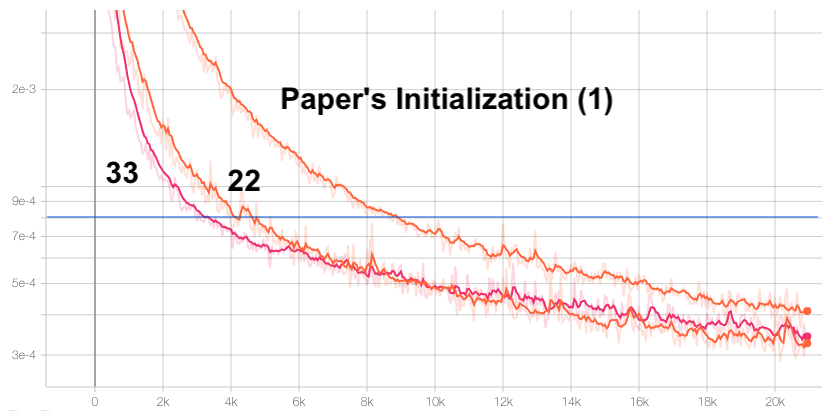
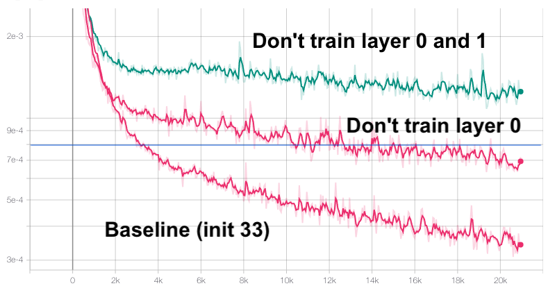

# Model Description

## Novel module

# Results

# Observations

## SIREN Random initialization and other hyperparameter experiments.

Here we compare 3 initialization methods (where `frequency=30`) on the training
of a SIREN network on `data/cat.jpg` with AdamW optimizer (default `eps=1e-8`) and auto_lr. MSE loss is used. Input coordinates are in range [-1, 1].
This is not meant to be a comprehensive test, but to give some indication.

These experiments are just in the order conducted based on the results of the previous
experiment(s), so the order is all over the place.

While the MSE value doesn't directly reflect upon the quality of the image,
the following values indicated different usability levels on this cat image:
1. `0.08` - low frequency info is there

  

2. `0.02` - majority of structure is present.

3. `0.0008` - Produced image looks largely similar to the input image, some high frequency detail is missing. Going past this error rate is mostly just for bragging rights.

Initialization methods:

1. Uniform with bounds `+- sqrt(6 / fan_in) / frequency`. First layer uniform bounds `+- 1/fan_in`. This is the initialization method suggested by the paper.
2. Normal with stddev `+- sqrt(6 / fan_in) / frequency`. First layer normal stddev `1/fan_in`.
3. Normal with stddev `+- sqrt(6 / fan_in) / frequency / 3`. First layer normal stddev `1/3fan_in/3`.
4. Uniform with bounds `+- sqrt(6 / fan_in) / frequency`. First layer normal stddev `1/fan_in`. This is to see if the first layer initialization is the most important.
5. Uniform with bounds `+- sqrt(6 / fan_in) / frequency`. First layer uniform bounds `+- 3/fan_in`. This is to directly compare initial layer normal vs uniform.
6. Uniform with bounds `+- sqrt(6 / fan_in) / frequency`. First layer normal stddev bounds `1.5/fan_in`. This is to compare if we can get the faster convergence of (5), but smoother.
7. Normal with stddev `+- sqrt(6 / fan_in) / frequency / 3`. First layer normal stddev bounds `1.5/fan_in`.
8. Normal with stddev `+- sqrt(6 / fan_in) / frequency / 2`. First layer normal stddev bounds `1.5/fan_in`.
9. Normal with stddev `+- sqrt(6 / fan_in) / frequency / 2`. First layer normal stddev bounds `4.5/fan_in`.
10. Normal with stddev `+- sqrt(pi / 2 / fan_in) / frequency`. First layer normal stddev bounds `1.5/fan_in`.
11. Normal with stddev `+- sqrt(pi / 2 / fan_in) / frequency`. First layer normal stddev bounds `pi/(2*fan_in)`.
12. Uniform with bounds `+- sqrt(6 / fan_in) / frequency`. First layer normal stddev bounds `1.73/fan_in`. This is `1/fan_in/input_coord_stddev` 
13. Uniform with bounds `+- sqrt(6 / fan_in) / frequency`. First layer normal stddev bounds `2/fan_in`. This is to see if going slightly past the stddev has any benefits.

Notes:
    1. If the input coordinates have a range `[-1, 1]`, then the stddev is 0.57792791 
    2. So far, it seems like first layer stddev 1.5/fan_in is best
    3. So far, it seems like around Normal with stddev `+- sqrt(6 / fan_in) / frequency / 2` reaches lowest loss.
    4. If we only care about what gets to ~8e-4 first, then init (5) and (6) are best, with 6 seeming a little more stable. 

In the following initialization experiments, the input coordinates were additionally normalized by their stddev `0.57792791` to further confirm some results.

14. Uniform with bounds `+- sqrt(6 / fan_in) / frequency`. First layer stddev `1/fan_in`. This is the initialization method suggested by the paper, but now we have our input have `stddev=1`.
15. Uniform with bounds `+- sqrt(6 / fan_in) / frequency`. First layer stddev `1/fan_in`. Set all bias explicitly to 0 (previously they were using the He bias initialization defaults in pytorch). Loss quickly went down, then quickly diverged...
16. Uniform with bounds `+- sqrt(6 / fan_in) / frequency`. First layer stddev `1/fan_in`. Divide all default torch bias initializations by 2.
17. Uniform with bounds `+- sqrt(6 / fan_in) / frequency`. First layer stddev `1/fan_in`. Divide all default torch bias initializations by 10.
18. Uniform with bounds `+- sqrt(6 / fan_in) / frequency`. First layer stddev `1/fan_in`. Set first layer bias to 0. Divide other biases by 10.
19. Uniform with bounds `+- sqrt(6 / fan_in) / frequency`. First layer stddev `1/fan_in`. Only divide first layer bias by 10.
20. Uniform with bounds `+- sqrt(6 / fan_in) / frequency`. First layer stddev `1/fan_in`. No bias parameters. Super terrible results, but super interesting at the same time, as the resulting image has the "opposite image" (rotated 180 degrees, inverted colors) super imposed over it.
21. Uniform with bounds `+- sqrt(6 / fan_in) / frequency`. First layer stddev `1/fan_in`. Divide all default torch bias initializations by 30. Slightly better convergence loss than (17), but slightly slower to get to a usable accuracy.
22. Uniform with bounds `+- sqrt(6 / fan_in) / frequency`. First layer stddev `1/fan_in`. Make all bias uniform `+- pi/30`. This should result in uniform use of sine phase shifts.
23. Uniform with bounds `+- sqrt(6 / fan_in) / frequency`. First layer uniform bounds `+- 1/fan_in`. Make all bias uniform (not random, like using `arange`) from `+-pi/30`. Very similar results to (22)
24. (23) but on `data/patio.jpg`
25. (17) but on `data/patio.jpg`, confirming that (17) is better on another image.
26. (23) but turn off weight_decay in the optimizer. No real impact.
27. Uniform with bounds `+- sqrt(6 / fan_in) / frequency`. First layer stddev `1/fan_in`. Make all bias uniform `+- pi*30`. This has approximately the same results as (22), as it should since `sin` is periodic. But, why does (17) still perform better?
28. Uniform with bounds `+- sqrt(6 / fan_in) / frequency`. First layer stddev `1/fan_in`. Make first bias uniform `+- pi/60`. Keep the rest same as (27). This results in not all phases being immediately available (`+- pi/2 ~ 1.571`), and should be worse, but we saw (17) have effective phase range `+- 2.1213` outperfrom in early training regimes.
29. Uniform with bounds `+- sqrt(6 / fan_in) / frequency`. First layer stddev `1/fan_in`. Make all bias uniform `+- pi/60` (1.5707). This is slightly worse than (17)
30. Uniform with bounds `+- sqrt(6 / fan_in) / frequency`. First layer stddev `1/fan_in`. Make all bias uniform `+- 2.5/frequency`. This is slightly worse than (29). Meaning there is some sweet spot between `(1.5707, 2.5)`
31. Uniform with bounds `+- sqrt(6 / fan_in) / frequency`. First layer stddev `1/fan_in`. Make all bias uniform `+- 3pi/4/frequency` (~2.356). This is slightly better than (30), slightly worse than (29). Suggesting the ideal value is somewhere in between `(1.5707, 2.1213)`
32. Uniform with bounds `+- sqrt(6 / fan_in) / frequency`. First layer stddev `1/fan_in`. Make all bias uniform `+- 2/frequency`. This was worse, so ideal value is in range `(2, 2.1213)`
33. Uniform with bounds `+- sqrt(6 / fan_in) / frequency`. First layer stddev `1/fan_in`. Divide all default torch bias initializations by 15. Very similar to (17), reaches the acceptable 8e-4 in about the same number of iterations, but generalized better.
34. (33) but on `data/patio.jpg`, confirming that (33) is better on another image.
35. (33) but set frequency to 10. Slow, but reaches similar losses.
36. (33) but set frequency to 50. Loss drops fast, but plateus early.
37. (33) but set frequency to 40. Almost useable, still plateus early
38. (37) but Set bias `/=20` About the same

Notes:
    1. Init method (33) trained the fastest while obtaining a reasonable lowest error. Reached 8e-4 in 450 epochs. The default initialization scheme took 1250 epochs to reach 8e-4, making init method 33 2.78x faster.
    2. Init method (18) trained fastest, but plateued at a much higher loss (above our 8e-4 requirement.)
    3. Init method (21) trained slightly slower than (17) until a loss of `7.5e-4`, but then achieved a lower overall loss

Intuition says that a uniform bias in range `+- pi` would yield best results, and it does eventually converge to the lowest loss, however these emperical results say dividing the He bias initialization by 10 reach an acceptable loss faster. No idea why.

Tensorboard files are located at:
    https://drive.google.com/file/d/1ITFoX_o3FCR_3gyPUr-mcd-iOlqh8li2/view?usp=sharing

The HPARAMS tab doesn't reflect these initialization changes as they were done directly in code.

Conclusions:

1. The correct initialization (33) can generate a useable result ~2.78x faster than the initialization recommended by the paper.
2. The best bias initialization experimented with was a modified He initialization (uniform random with bounds `+-2/(frequency*sqrt(fan_in))`). In this implementation, the activation function is defined as `sin(frequency * (wx + b))` where `frequency=30`. Initialization method (22) where the bias is randomly uniformly sampled from  `+-pi/30` makes the most sense and achieves the lowest loss, but at a slightly slower rate.

## HyperNetwork for SIREN initialization (metalearning)
TODO

## Not training earlier layers
Using init method (33), we experimented with the impact of not training the first
layer and the second layer. They result in a network training that doesn't meet
our cutoff:

